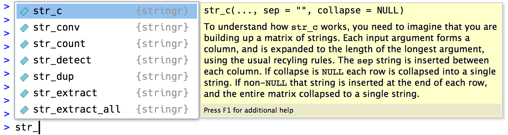

## 14.1 Introduction

이 장에서는 R에서의 `string` 조작에 대해 소개한다. `string`의 작동 원리와 직접 작성하는 방법에 대해 배우며, 정규표현식이나 짧은 정규표현식에 초점이 맞춰져 있다. 문자열이 보통 반정형, 비정형 데이터를 포함하고 있는 경우가 많아 정규표현식은 이들을 다루는데 유용하며 간단할 것이다.

### Prerequisites

```{r setup, message = FALSE}
library(tidyverse)
library(stringr)
```

## 14.2 String basics

`string`은 큰따옴표와 작은 따옴표로 생성할 수 있다. 다른 언어들과는 다르게 둘의 차이점은 없다. 저자는 문자열 안에 “”를 쓰는 경우가 아니면 항상 큰따옴표를 쓰는 것을 추천하고 있다.

```{r}
string1 <- "This is a string"
string2 <- 'If I want to include a "quote" inside a string, I use single quotes'
```
만약 따옴표를 닫는 것을 잊었다면 esc를 누르고 다시 실행하면 된다.

`string` 안에 큰따옴표나 작은 따옴표를 포함시키기 위해선 `\`를 이용하거나 서로 다른 따옴표의 구분을 이용할 수 있다. 

```{r}
double_quote <- "\"" # or '"'
single_quote <- '\'' # or "'"
```

마찬가지로 `string` 안에 백슬래시`\` 를 포함시키고 싶다면 백슬래시를 두 번 쓰면 된다. `\\`.

출력되어진 `string`의 표현과 `string` 자체는 다르다는 것을 염두 해야 한다. 날 것의 `string`을 보고싶다면 `writeLines() :` 를 쓰면 된다.

```{r}
x <- c("\"", "\\")
x
writeLines(x)
```

그 밖에도 유능한 문자들이 있다. 가장 흔히 쓰는 `\n`은 줄바꾸기 그리고 `/t`는 tab을 의미한다. R에서 `?"'"`. 를 치면 그 외의 문자들을 확인 할 수 있다.

많은 문자들은 `c():` 를 이용하여 벡터로 저장이 가능하다.

```{r}
x <- "\u00b5"
x
```

```{r}
c("one", "two", "three")
```

### 14.2.1 String length

R에서 문자열에 대해 기본적으로 내장되어있는 명령어들은 많지만, 외우기 힘들기 때문에 `Stringr` 패키지에 있는 명령어들을 사용하는 것이 좋다. 직감적으로 이해하기 쉬운 이름들로 되어있고 `str`로 시작된다. 예를 들어 `str_length():` 는 `string`의 문자 수를 알려준다.

```{r}
str_length(c("a", "R for data science", NA))
```

특히 `Rstudio`를 사용하는 사람들은 str만 쳐도 자동완성기능이 뜨기 때문에 더 편리하다고 느껴질 것이다.

```{r, echo = FALSE}

```

### 14.2.2 Combining strings

두개의 string을 결합하기 위해선 `str_c():` 를 이용 (벡터 원소간의 결합은 아니다.)

```{r}
str_c("x", "y")
str_c("x", "y", "z")
```

결합 후 string 간의 분리 기호를 넣고 싶다면 `sep = “”` 를 이용

```{r}
str_c("x", "y", sep = ", ")
```

R에서 많은 기능들이 그렇듯, 결측값은 많은 혼동을 주게 되는는데
결측값을 “NA”로 출력하고 싶으면 `str_replace_na():` 를 이용

```{r}
x <- c("abc", NA)
str_c("|-", x, "-|")
str_c("|-", str_replace_na(x), "-|")
```

위에서 보듯이 `str_c():` 는 벡터화시킨다.

```{r}
str_c("prefix-", c("a", "b", "c"), "-suffix")
```

대상의 길이가 0인 경우에는 자동으로 삭제되는데 이는 if절에서 유용하게 쓰인다.

```{r}
name <- "Hadley"
time_of_day <- "morning"
birthday <- FALSE

str_c(
  "Good ", time_of_day, " ", name,
  if (birthday) " and HAPPY BIRTHDAY",
  "."
)
```

String으로 이루어진 벡터를 단일 string으로 만들려면 `collapse = “”` 를 쓰고 구분 기호를 따옴표 안에 넣어 주면 된다.

```{r}
str_c(c("x", "y", "z"), collapse = ", ")
```

### 14.2.3 Subsetting strings

`str_sub(변수, start, end)`을 이용하여 string에서 특정부분을 추출 할 수 있다.
start와 end는 string의 위치를 나타낸다.

```{r}
x <- c("Apple", "Banana", "Pear")
str_sub(x, 1, 3)
# negative numbers count backwards from end
str_sub(x, -3, -1)
```

start와 end의 길이에 비해 string이 짧더라도 오류가 뜨진 않고 대상의 전체를 출력한다. 

```{r}
str_sub("a", 1, 5)
```

또한 str_sub():을 이용해 string의 특정부분을 조작할 수 있다.

```{r}
str_sub(x, 1, 1) <- str_to_lower(str_sub(x, 1, 1))
x
```

### 14.2.4 Locales

위의 예제처럼 `str_to_lower()`을 이용하면 텍스트를 대문자에서 소문자로 변환할 수 있다.
`str_to_upper()`, `str_to_title()`는 각각 소문자에서 대문자 변환, 첫글자 대문자 변환의 기능을 한다.
하지만 다른 언어에서는 다른 방식의 변환이 필요하고 우리는 특정 지역의 방식을 설정해 놓을 수 있다. 

```{r}
# Turkish has two i's: with and without a dot, and it
# has a different rule for capitalising them:
str_to_upper(c("i", "ı"))
str_to_upper(c("i", "ı"), locale = "tr")
```

지역에 따라 분류 순서도 지정할 수 있다.
`str_order()`는 순서 번호를 매겨 표현해준다.

```{r}
x <- c("apple", "eggplant", "banana")

str_sort(x, locale = "en")  # English

str_sort(x, locale = "haw") # Hawaiian
```

### Exercises

1. `paste()` 이랑 `paste0()`의 차이점은 무엇이고, stringr에서의 어떤함수가 이 기능을 수행합니까?
`NA` 처리 방법은 어떻게 다릅니까?

`paste()` 는 공백이 있는 문자열을 구분하지만, `paste0()`는 공백을 구분하지 않습니다.

```{r}
paste("foo", "bar")
paste("foo", "bar")
```

`str_c`가 이 기능을 수행하는데 `paste0()`처럼 공백이 있는 문자열을 분리시키지 않습니다.

```{r}
str_c("foo", "bar")
```

`NA`의 경우 `str_c`는 결측값이 존재하면 결측값으로 반환을 합니다. 이것은 `sum` 이나 `mean`과 같은 처리 방식입니다.

```{r}
str_c("foo", NA)
paste("foo", NA)
paste0("foo", NA)
```


## 14.3 Matching patterns with regular expressions

### 14.3.1 Basic matches

`str_view(데이터, “문자”)`를 이용하여 문자가 포함되어있는 string을 찾을 수 있다.

```{r}
x <- c("apple", "banana", "pear")
str_view(x, "an")
```

“.문자.” 와 같이 . 을 이용하여 문자 주변의 글자까지 같이 잡아 줄 수 있다.

```{r}
str_view(x, ".a.")
```

.이 포함된 string을 찾고 싶다면, `\\.` 을 이용하면 된다.
이유는 밑의 예시에 나와있다.

```{r}
# To create the regular expression, we need \\
dot <- "\\."

# But the expression itself only contains one:
writeLines(dot)

# And this tells R to look for an explicit .
str_view(c("abc", "a.c", "bef"), "a\\.c")
```

같은 이유에서 `\`이 포함된 string을 찾고싶다면 `\`를 4번 써야한다.

```{r}
x <- "a\\b"
writeLines(x)

str_view(x, "\\\\")
```

### Exercises

1. 이러한 문자열들이 일치하지 않는 이유를 설명하세요. `"\"`, `"\\"`, `"\\\"`.

* `"\"` : `"\"`다음 문자를 이스케이프 합니다.
* `"\\"` : `\`정규 표현식의 다음 문자를 이스케이프 처리하는 정규 표현식으로 처리됩니다
* `"\\\"` : 첫 번째 두 개의 백 슬래시는 정규식에서 리터럴 백 슬래시로 처리되고 세 번째는 다음 문자를 이스케이프합니다. 따라서 정규 표현식에서는 일부 이스케이프 된 문자가 이스케이프됩니다.

### 14.3.2 Anchors

정규식을 이용하여 string의 첫부분과 끝부분을 원하는 문자와 match가 가능하다. 
* `^`   string의 첫글자를 match시킨다.
* `$`   string의 끝글자를 match 시킨다. 

```{r}
x <- c("apple", "banana", "pear")
str_view(x, "^a")
str_view(x, "a$")
```

이는 물론 글자가 아닌 string으로도 match가 가능하다.

```{r}
x <- c("apple pie", "apple", "apple cake")
str_view(x, "apple")
str_view(x, "^apple$")
```

### Exercises

1. literal string `"$^$"`를 어떻게 일치시키나요?

```{r}
str_view(c("$^$", "ab$^$sfas"), "^\\$\\^\\$$")
```

### 14.3.3 Character classes and alternatives

특별한 패턴, 조건을 가진 문자와도 match가 가능하다.

* `\s`: white space와 match 시켜준다.(줄 바꿈, 띄어쓰기, tab…)
*	`[abc]`: a, b 또는 c와 match 시켜준다.
*	`[^abc]`: a, b 또는 c를 빼고 match 시켜준다.

```{r}
str_view(c("widow maker", "soldier76"),"\\d")
```

String 안에 괄호를 넣어 조건을 추가할 수 있다.

```{r}
str_view(c("grey", "gray"), "gr(e|a)y")
```

### Exercises

1.다음과 같은 모든 단어를 찾는 정규 표현식을 만드세요.
  
  1. 모음으로 시작하는 단어를 찾으세요..
  
```{r}
str_view(stringr::words, "^[aeiou]", match=TRUE) 
```

  2. 자음만 들어가게 하세요.

```{r}
str_view(stringr::words,"^[^aeiou]+$", match=TRUE) 
```


### 14.3.4 Repetition

`str_view(데이터, “a”)` 에서 a에 패턴을 추가하는 방법에 대해 알아보자.

```{r}
x <- "1888 is the longest year in Roman numerals: MDCCCLXXXVIII"
str_view(x, "CC?")
str_view(x, "CC+")
str_view(x, 'C[LX]+')
```

* `{n}`: 오직 n개만
*	`{n,}`: n개 이상
*	`{,m}`: 최대 m개
*	`{n,m}`: n개 이상, m개 이하


```{r}
str_view(x, "C{2}")
str_view(x, "C{2,}")
str_view(x, "C{2,3}")
```

결과값에서 가장 짧은 string을 match하고 싶다면 ?를 추가입력하면 된다

```{r}
str_view(x, 'C{2,3}?')
str_view(x, 'C[LX]+?')
```


### Exercises

1.이 정규식이 일치하는 단어를 설명하십시오 

    1. `^.*$` 임의의 문자열
    
    2. `"\\{.+\\}"` 하나 이상의 문자를 둘러싸는 중괄호가있는 문자열
    
    3. `\d{4}-\d{2}-\d{2}`"% Y- % m- % d"형식의 날짜 : 대시가 뒤따라 오는 네 자리 숫자 다음에 두 자리 숫자 다음에 대시 기호가오고 그 다음 두 자리 숫자 뒤에는 대시가 따라옵니다
    

### 14.3.5 Grouping and backreferences

```{r}
str_view(fruit, "(..)\\1", match = TRUE)
```

### Exercises

* `(.)(.)(.).*\\3\\2\\1` 를 설명하시오.

3 개의 문자 뒤에는 0 개 이상의 문자가 올 수 있으며 그 뒤에는 동일한 세 문자가 오지만 그 반대가됩니다. 예 : "abcsgasgddsadgsdgcba"또는 "abccba"또는 "abc1cba".

## 14.4 Tools

이 장에서는 실전 문제에 적용하기위한 다음과 같은 종류의 함수들을 다룰 것 입니다.

* 패턴과 일치하는 문자열을 결정하기
* 일치하는 위치와 매치하기
* 일치하는 내용을 추출하기
* 일치항목을 다른 값으로 바꾸기
* 일치하는 문자열을 나누기

### 14.4.1 Detect matches 

문자 벡터가 패턴과 일치하는지 확인하려면 `str_detect()`를 사용하면됩니다. 이 함수는 입력한 벡터와 동일한 길의의 논리형벡터를 반환합니다.

```{r}
x <- c("apple", "banana", "pear")
str_detect(x, "e")
```

논리형벡터는 `false`=0,`true`=1이기 때문에 이를 이용해 `sum()`이나 `mean()`을 이용한 문제들을 해결할 수 있습니다.

```{r}
# How many common words start with t?
sum(str_detect(words, "^t"))
# What proportion of common words end with a vowel?
mean(str_detect(words, "[aeiou]$"))
```

논리연산자를 결합해서 `str_detect()`를 사용하면, 해결하고자 하는 문제를 더 쉽게 해결할 수 있습니다.

```{r}
# Find all words containing at least one vowel, and negate
no_vowels_1 <- !str_detect(words, "[aeiou]")
# Find all words consisting only of consonants (non-vowels)
no_vowels_2 <- str_detect(words, "^[^aeiou]+$")
identical(no_vowels_1, no_vowels_2)
```

위에서 동일한 결과가 나왔지만, 첫번째 방법이 이해하기 더 쉽습니다. 

`str_detect()`는 논리형을 반환하는 함수이기 때문에 패턴과 일치하는 요소를 골라낼 수 있습니다. 이는 `str_subset()`으로도 같은 결과를 낼 수 있습니다.

```{r}
words[str_detect(words, "x$")]
str_subset(words, "x$")
```

문자열이 열벡터일땐 `filter`를 이용해 문제를 해결하면 됩니다. 

```{r}
df <- tibble(
  word = words, 
  i = seq_along(word)
)
df %>% 
  filter(str_detect(words, "x$"))
```

`str_count()`는 True False가 아닌 문자열과 일치하는 숫자값을 반환합니다.

```{r}
x <- c("apple", "banana", "pear")
str_count(x, "a")

# On average, how many vowels per word?
mean(str_count(words, "[aeiou]"))
```

`str_count()`는 다음과 같이 활용될 수도 있습니다.

```{r}
df %>% 
  mutate(
    vowels = str_count(word, "[aeiou]"),
    consonants = str_count(word, "[^aeiou]")
  )
```

밑에 `aba`가 `abababa`에 두번 있다고 나오는 것 처럼 중복처리는 하지 않습니다.

```{r}
str_count("abababa", "aba")
str_view_all("abababa", "aba")
```

### Exercises

1. 다음의 각 과제에 대해 하나의 정규 표현식과 여러 `str_detect()`호출 의 조합을 사용하여 문제를 해결하십시오 .

  1. words에서 `x`로 시작하거나 끝나는 모든단어.
  
```{r}
  words[str_detect(words, "^x|x$")]
```

  2. words에서 모음으로 시작하고 자음으로 끝나는 모든단어.

```{r}
str_subset(words, "^[aeiou].*[^aeiou]$")%>% head()
```

  3. words에서 모든 모음이 적어도 한번씩 들어가는 단어가 있는가?
  
```{r}
words[str_detect(words, "a") &
        str_detect(words, "e") &
        str_detect(words, "i") &
        str_detect(words, "o") &
        str_detect(words, "u")]
```
  => 존재하지 않는다.
  

### 14.4.2 Extract matches

일치하는 텍스트를 추출하기 위해서는 `str_extract()`를 사용합니다.

```{r}
length(sentences)
head(sentences)
```

sentences에서 색이름이 들어간 문장을 추출하기 위해 먼저 색이름으로 이루어진 벡터를 만들고 단일정규화시켜줍니다.

```{r}
colours <- c("red", "orange", "yellow", "green", "blue", "purple")
colour_match <- str_c(colours, collapse = "|")
colour_match
```

`str_subset()`를 이용해서 색이름이 들어간 문장을 뽑아내고, `str_extract()`로 문장에 들어간 색이름을 추출합니다.

```{r}
has_colour <- str_subset(sentences, colour_match)
matches <- str_extract(has_colour, colour_match)
head(matches)
```

하지만 `str_extract()`는 한문장에서 처음 일치되는 항목만 추출합니다.

```{r}
more <- sentences[str_count(sentences, colour_match) > 1]
str_view_all(more, colour_match)

str_extract(more, colour_match)
```

문장안에 일치하는 모든 항목을 추출하기 위해선 `str_extract_all()`를 사용합니다.

```{r}
str_extract_all(more, colour_match)
```

`str_extract_all()`을 사용할 때 `simplify = TRUE`을 같이 사용하면 행렬을 반환합니다.

```{r}
str_extract_all(more, colour_match, simplify = TRUE)

x <- c("a", "a b", "a b c")
str_extract_all(x, "[a-z]", simplify = TRUE)
```

### Exercises

1. 앞의 예제에서 정규 표현식이 "flickered"과 일치한다는 사실을 알았을 것입니다.이 표현식은 색상이 아닙니다. 정규식을 수정하여 문제를 해결하십시오.

```{r}
colour_match2 <- str_c("\\b(", str_c(colours, collapse = "|"), ")\\b")
colour_match2
more2 <- sentences[str_count(sentences, colour_match) > 1]
str_view_all(more2, colour_match2, match = TRUE) 
```

2. Havard sentences data에서 다음을 추출하시오.

  1. 각 문장의 첫 단어.

```{r}
str_extract(sentences, "[^ ]+") %>% head()
```

  2. `ing`로 끝나는 모든 단어

```{r}
pattern <- "\\b[^ ]+ing\\b"
sentences_with_ing <- str_detect(sentences, pattern)
unique(unlist(str_extract_all(sentences[sentences_with_ing], pattern))) %>% head()
```

### 14.4.3 Grouped matches

앞에서는 단일단어만 추출했지만, 이번 장에서는 두단어를 그룹으로 묶어서 추출을 합니다. 예를들어 a나 the같은 관사를 붙인 단으를 찾을때 다음과 같이 합니다.

```{r}
noun <- "(a|the) ([^ ]+)"

has_noun <- sentences %>%
  str_subset(noun) %>%
  head(10)
has_noun %>% 
  str_extract(noun)
```

`str_extract()`는 일치하는 단어만을 보여주지만, `str_match()`의 경우 그룹을 이루는 단어의 구성요소까지 포함하여 행렬로 반환을 합니다.

```{r}
has_noun %>% 
  str_match(noun)
```

tibble data의 경우 `tidyr::extract()`를 사용해서 `str_match()`와 같은 효과를 볼 수 있습니다. 다만 이때는 열이름을 새로 지정해 줘야 합니다.

```{r}
tibble(sentence = sentences) %>% 
  tidyr::extract(
    sentence, c("article", "noun"), "(a|the) ([^ ]+)", 
    remove = FALSE
  )
```

### Exercises

1. "1", "2", "3"등과 같은 "숫자"뒤에 나오는 단어를 모두 찾으십시오. 번호와 단어를 모두 꺼내십시오."

```{r}
numword <- "(one|two|three|four|five|six|seven|eight|nine|ten) +(\\S+)"
sentences[str_detect(sentences, numword)] %>%
  str_extract(numword)
```

2. 모든 축소된 단어를 찾으십시오. '(어퍼스트로피) 전후로 조각을 구분하십시오.

```{r}
contraction <- "([A-Za-z]+)'([A-Za-z]+)"
sentences %>%
  `[`(str_detect(sentences, contraction)) %>%
  str_extract(contraction)
```

### 14.4.4 Replacing matches

`str_replace()`와 `str_replace_all`은 기존의 문자열을 새로운 문자열로 바꿀 수 있습니다. 먼저 패턴을 이용한 방법입니다.

```{r}
x <- c("apple", "pear", "banana")
str_replace(x, "[aeiou]", "-")
str_replace_all(x, "[aeiou]", "-")
```

위와같이 패턴을 이용하여 처리할 수 도 있지만, `str_replace_all()`를 이용하면 벡터를 이용해서 한번에 처리가 가능합니다.

```{r}
x <- c("1 house", "2 cars", "3 people")
str_replace_all(x, c("1" = "one", "2" = "two", "3" = "three"))
```

역 참조 기법을 이용해서 대체할수도 있습니다. 다음 코드는 두번째 단어와 세번째 단어의 위치를 뒤집습니다. 
```{r}
sentences %>% 
  str_replace("([^ ]+) ([^ ]+) ([^ ]+)", "\\1 \\3 \\2") %>% 
  head(5)
```

### Exercises

1. 문자열의 모든 slash를 backslash로 바꾸십시오.

```{r}
y<-c("/","abc/","/bc")
str_replace_all(y,"/","\\\\")
```

2. `replace_all()`을 사용해서 `str_to_lower()`를 만드세요.

```{r}
str_replace_all(c("ABC","ADD"),c("A"="a","B"="b","C"="c","D"="d"))
```

### 14.4.5 Splitting

`str_split()`는 문자열을 조각으로 나눌 때 사용 합니다. 예를 들어 문장을 단어로 나눌 수 있습니다.

```{r}
sentences %>%
  head(5) %>% 
  str_split(" ")
```

각 구성 요소에는 다른 개수의 조각이 포함될 수 있으므로 리스트를 반환합니다. 길이가 1 인 벡터로 작업하는 경우 가장 쉬운 방법은 리스트의 첫 번째 요소만을 추출하는 것입니다.

```{r}
"a|b|c|d" %>% 
  str_split("\\|") %>% 
  .[[1]]
```

`str_split()`에 `simplify=TRUE`를 추가하면 행렬로 반환해 줍니다.

```{r}
sentences %>%
  head(5) %>% 
  str_split(" ", simplify = TRUE)
```

`simplify=TRUE`앞에 숫자를 추가해주면 열벡터의 수를 정할 수 있습니다.

```{r}
str_split(sentences," ", n = 2, simplify = TRUE) %>% head()
```

패턴에 `boundary()`를 쓰고 그 안에 word, character, line, sentence를 사용하면 단어, 문자열, 줄, 문장으로 분할 할 수 있습니다.

```{r}
x <- "This is a sentence.  This is another sentence."
str_view_all(x, boundary("word"))

str_split(x, " ")[[1]]
str_split(x, boundary("word"))[[1]]
str_split(x, boundary("character"))[[1]]
```

#### Exercises

1 `"apples, pears, and bananas"`을 개별구성요로소 나누시오.

```{r}
x <- c("apples, pears, and bananas")
str_split(x, ", +(and +)?")[[1]]
```

2 `boundary("word")` 가 `" "` 보다 좋은이유는?

`boundary("word")`는 공백을 반환하지 않는다.

```{r}
x<- " 공백이  너무    많다    ."
str_split(x, " ")[[1]]
str_split(x, boundary("word"))[[1]]
```

3 빈 문자열 ( "")로 분할을 하면 어떻게 됩니까?

```{r}
str_split(x, "")[[1]]
```

문자열로 분할한다.

## 14.5 Other types of pattern

패턴을 사용할 때, `regex()`함수가 자동적으로 호출이 됩니다.

```{r, eval = FALSE}
# The regular call:
str_view(fruit, "nana")
# Is shorthand for
str_view(fruit, regex("nana"))
```

`regex()`안에 다른 아규먼트를 사용해서 세부적인 것을 조정할 수 있습니다.

* `ignore_case = TRUE`는 대문자와 소문자를 모두 인식할 수 있도록 도와줍니다.

```{r}
bananas <- c("banana", "Banana", "BANANA")
str_view(bananas, "banana")
str_view(bananas, regex("banana", ignore_case = TRUE))
```

* `multiline = TRUE`는 전체문자열이 아닌 각 줄의 시작과 끝을 일치시켜줍니다.
    
```{r}
x <- "Line 1\nLine 2\nLine 3"
str_extract_all(x, "^Line")[[1]]
str_extract_all(x, regex("^Line", multiline = TRUE))[[1]]
```
    
* `comments = TRUE`는 주석과 공백을 사용하여 복잡한 정규 표현식을보다 이해하기 쉽게 만들어 줍니다. `\\`을 사용해서 literal 과 일치시켜 줄 수 있습니다.
    
```{r}
phone <- regex("
  \\(?     # optional opening parens
  (\\d{3}) # area code
  [)- ]?   # optional closing parens, dash, or space
  (\\d{3}) # another three numbers
  [ -]?    # optional space or dash
  (\\d{3}) # three more numbers
  ", comments = TRUE)
    
str_match("514-791-8141", phone)
```
    
* `dotall = TRUE`는 `.`을 포함해서 일치시켜줍니다.

다음은 `regex()`를 대신해서 쓸 수 있는 함수들입니다.

* `fixed()`는 `regex()`보다 더 빠르게 작동하는 함수입니다. 이것은 모든 특수 정규 표현식을 무시하고, 문자열의 bite로만 비교합니다. 밑의 예제에서는 `regex()`보다 3배 빠르게 작동한 것을 확인할 수 있습니다.

`install.packages('microbenchmark')`

```{r}
microbenchmark::microbenchmark(
  fixed = str_detect(sentences, fixed("the")),
  regex = str_detect(sentences, "the"),
  times = 20
)
```
    
하지만 `fixed()` 같은문자를 여러가지의 방법으로 표현이 가능할때 문제점이 드러납니다. 예를들어 "á"는 그 자체의 코드가 있고, "a"에 악센트코드를 넣는 방법이 있습니다.
    
```{r}
a1 <- "\u00e1"
a2 <- "a\u0301"
c(a1, a2)
a1 == a2
```

이 둘은 다르게 정의되어있기 때문에 `fixed()`는 둘을 다르게 인식합니다. 이럴때 `coll()`을 사용하면 둘을 같게 인식할 수 있습니다.

```{r}
str_detect(a1, fixed(a2))
str_detect(a1, coll(a2))
```
    
* `coll()` 표준 collation규칙을 사용하여 문자를 비교하며, 대소문자를 구분하지않고 일치시키는데 유용합니다. 
    
```{r}
# That means you also need to be aware of the difference
# when doing case insensitive matches:
i <- c("I", "İ", "i", "ı")
i
    
str_subset(i, coll("i", ignore_case = TRUE))
str_subset(i, coll("i", ignore_case = TRUE, locale = "tr"))
```
    
`coll()`은 동일한 문자를 인식하는 규칙이 복잡하기 때문에 `regex()`나 `fixed()`에 비해 처리속도가 상대적으로 느립니다.

* `boundary()`앞에서도 쓰인 것처럼 word, character, line, sentence으로 나누는데 쓰입니다.
    
```{r}
x <- "This is a sentence."
str_view_all(x, boundary("word"))
str_extract_all(x, boundary("word"))
```
    
    
    
### Exercises

1. `refex()`와 `fixed()`에서 어떻게 `\`를 포함하는 문자열을 찾나요?

```{r}
str_subset(c("a\\b", "ab"), regex("\\\\"))
str_subset(c("a\\b", "ab"), fixed("\\"))
```


2. sentences에서 가장 많이 쓰인 단어 5개는 무엇인가요?

```{r}
str_extract_all(sentences, boundary("word")) %>%
  unlist() %>%
  str_to_lower() %>%
  tibble() %>%
  set_names("word") %>%
  group_by(word) %>%
  count(sort = TRUE) %>%
  head(5)
```


## 14.6 Other uses of regular expressions

다음은 유용한 함수 두개를 소개하겠습니다.

*   `apropos()` 는 global환경에서 사용가능한 모든 객체를 찾아줍니다. 함수의 이름이 생각이 안날 때 유용합니다.

```{r}
apropos("replace")
```
    
*   `dir()`   는 디렉토일 안의 모든 파일을 나열합니다.`pattern`을 통해서 일치하는 모든 파일들을 검색할 수 있습니다. 밑에는 현재 디렉토리 안의 R Markdown파일을 검색한 것 입니다.
    
```{r}
head(dir(pattern = "\\.Rmd$"))
```
    
    
    
## 14.7 stringi

`stringr`은 `stringi` 패키지를 기반으로 만들어졌습니다. `stringr`은 가장 일반적인 문자열 조작 함수를 처리 할 때 신중하게 선택되는 최소한의 함수 집합을 제공하므로 학습 할 때 유용합니다.  `stringi`는 string에 대해서 포괄적으로 되어있으며 총 232가지의 함수를 갖고 있습니다.

`stringr`에서 잘 해결되지 않는 문제가 있을 때 `stringi`를 확인해 볼 필요가 있습니다. 패키지는 매우 유사하게 작동하므로 문자열 인식을 자연스럽게 변환 할 수 있어야합니다. `stringi`의 접두사는 `stri_`입니다.


### Exercises

`install.packages('stringi')`
`library(stringi)`

```{r}
library(stringi)
```

1. 다음에 해당되는 `stringi`함수를 찾으시오.

  1. 단어의 수를 세는 함수

```{r}
stri_count_words(sentences, locale = NULL) %>% head()

```
  
  2. 중복된 문자열을 찾는 함수
  
```{r}
stri_duplicated(c("a", "b", "a", NA, "a", NA))
stri_duplicated(c("a", "b", "a", NA, "a", NA), fromLast=TRUE)
stri_duplicated_any(c("a", "b", "a", NA, "a", NA))
```
  
  3. random text를 생성하는 함수
  
* `stri_rand_lipsum` `lorem ipsum`을 random 생성한다.

```{r}
stri_rand_lipsum(1)
```

* `stri_rand_shuffle` 주어진 텍스트를 섞어서 반환한다. 

```{r}
stri_rand_shuffle(c("abcdefghi", "0123456789"))
```

* `stri_rand_strings` random 문자열을 생성한다.

```{r}
n <- 10
stri_rand_shuffle(stri_paste(
stri_rand_strings(n, 1, '[0-9]'),
stri_rand_strings(n, 1, '[a-z]'),
stri_rand_strings(n, 1, '[A-Z]'),
stri_rand_strings(n, sample(5:11, 5, replace=TRUE), '[a-zA-Z0-9]')
))

```